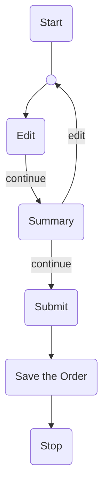
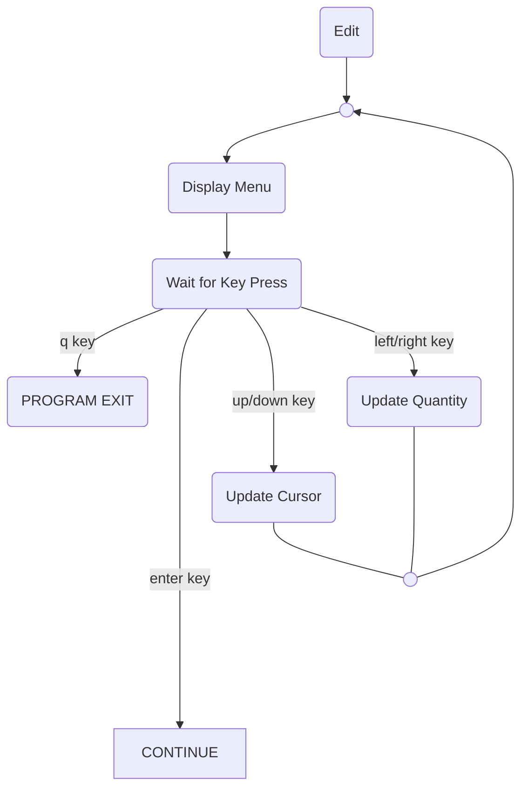
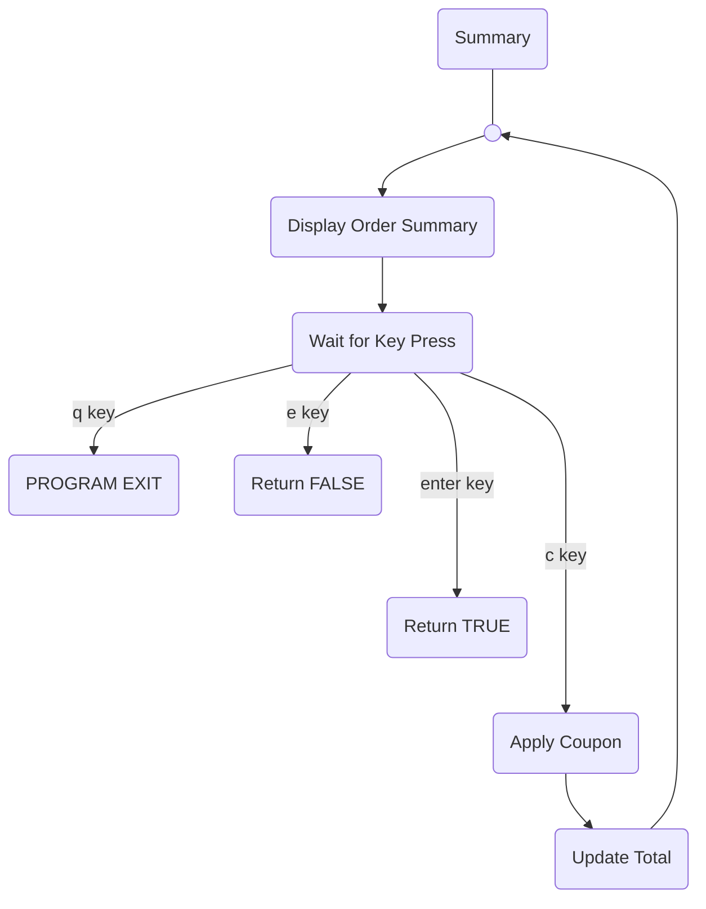

# Table of Contents
```table-of-contents
style: nestedList # TOC style (nestedList|inlineFirstLevel)
minLevel: 0 # Include headings from the specified level
maxLevel: 0 # Include headings up to the specified level
includeLinks: true # Make headings clickable
debugInConsole: false # Print debug info in Obsidian console
```
# Introduction
Due to the restriction of not using additional classes, the code of this program is very messy. But I took the oppotunity to learn how to design a user friendly Command Line Application design and learn about some C# fundamental. The program is written entirely with .NET built in functionalities, with no external library. The interface of this application is inspired by a very common and user-friendly CLI app design. User is presented with choices and they can navigate around and pick choices by pressing specific keyboard key.

# Design Decision
The code base consisted of a few important parts:

## `Program` class & `Main` method
Implements the main loop of the application control flow. It initializes two important application states: a list (array) of items quantity and the cursor position. Additionally, it also create variables for order bill information.

### Main Flow

First the application enter the `Edit` mode. When the user chooses to continue it will enter the `Summary` mode. User will have the decision to go back to the `Edit` mode or continue, finishing the order.



### The Edit Flow
When the application enter the editing mode, the application simply clear the screen, display the menu, wait for key press, and response to those input. This will repeat until the user press an enter key which will return `Edit()`.



### The Summary flow
Summary mode works in a very similar way to Edit mode. The only difference are the set of keys that the user can press and how the loop exits. 

User can press `e` to edit the order, `c` to apply coupon, or `enter` to continue. The loop will return `false` if the user chooses to edit and `true` if they choose to continue. This boolean value will then be used by the main loop to determine if it should go back and start the Edit mode again or simply continue.



### The Coupon flow
This flow will only happened during the summary mode when the user press `c` key. It asks the user for a text input and check the `coupons` Dictionary and update `discount` accordingly. There are no input validation for this mode.

### The Saving to File
If the user says yes to saving their order, the app will prompt them to input a filename. It will repeat the same process again if a file already with the same name in current directory. If the file does not exist, the app simply create a new text file with the provided name and dump all the order summary and bill in there.

### `Mode Code` 
To have a better readibility and maintainability, an enum class can be used to represent mode code. But since extra classes are not allowed in this assignment. I decided to create integer variables with ALL_CAPITAL_LETTERS to represent mode code. 

I do not want to overuse Dictionary, so I use if else statement to convert the user input into mode code.

> [!EXTRA DETAILS]
> - All Variable names are in `snake_case`
> - All Method names are in `PascalCase`
> - All Constants are in `ALL_CAPITAL_LETTERS`
> - State variables such as quantity and cursor_position are pass by reference to be updated
