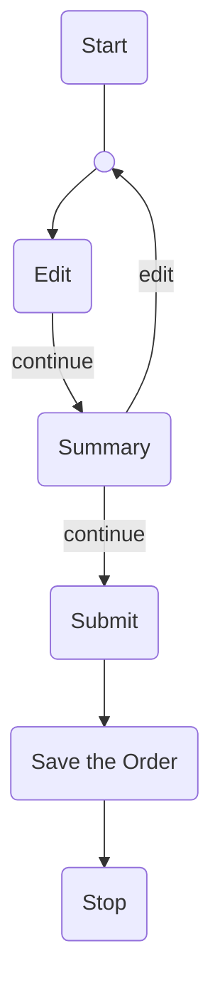
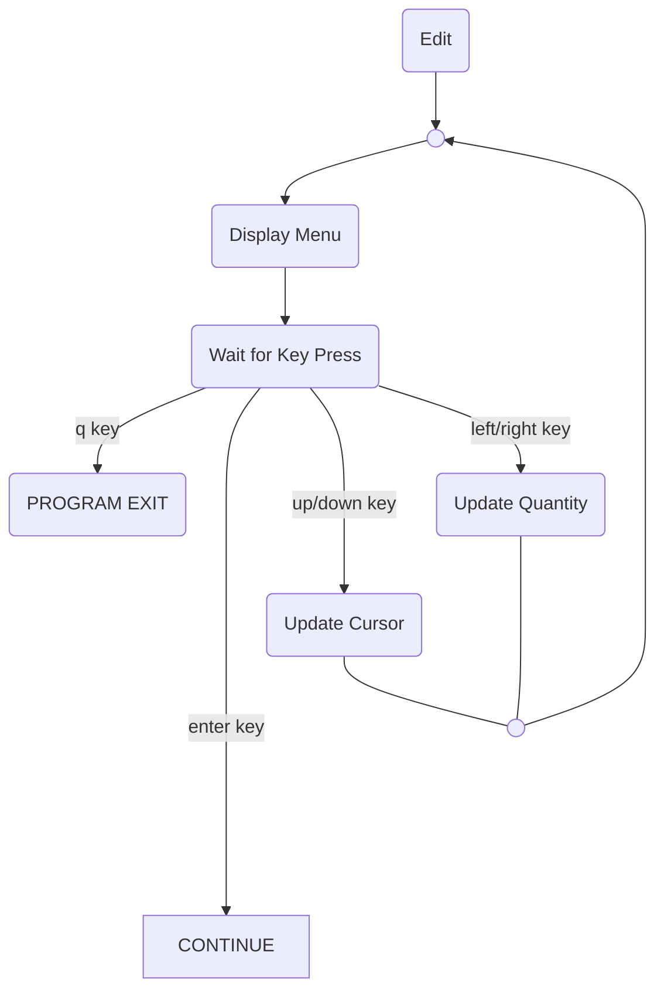
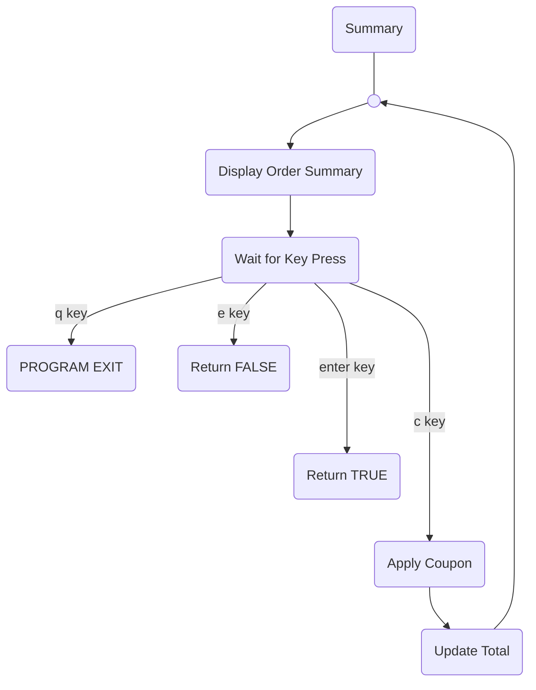

# Table of Contents
```table-of-contents
style: nestedList # TOC style (nestedList|inlineFirstLevel)
minLevel: 0 # Include headings from the specified level
maxLevel: 0 # Include headings up to the specified level
includeLinks: true # Make headings clickable
debugInConsole: false # Print debug info in Obsidian console
```
# Introduction
This project present opportunities to practice SOLID principal, Command Line Application design, and some Object Oriented patterns. The program is written entirely with .NET built in functionalities, with no external library. The interface of this application is inspired by a common and user-friendly CLI app design. User is presented with choices and they can navigate around and pick choices by pressing specific keyboard key. This design allowed the control flow to be less complex and more straight forward to implement.

# Design Decision
The code base consisted of a few important parts:

## `Program` class
 Implements the main loop of the application control flow. It initializes a new `Order` along with a menu, tax, and available coupons information.

## `Order` class
Implements smaller control flow for menu editing mode, summary mode, and the final file saving mode along with method for handling user inputs. It also contains important application states such as items' quantity, cursor position, and bill information. 

```d2
Order: {
	shape: class
	
	items: "Item[]"
	cursor_pos: int
	_bill information

	Edit(): void
	Summary(): bool
	HandleSaveOrder(): void

	_Update Cursor Pos(): void
	_Update Item Quantity(): void
	_Handle User Key Press(): ModeCode
	_Calculate Bill(): void
	_File Save helper(): void
}
```

> [!NOTE]
> All of the UML class diagram will only mentions important variables and methods. Some of the less important members of the class might be condensed into a single variable starting with a "_" character. 

## `Items` struct
A helper struct for the `Order` object. It helps encapsulate data by storing a menu item's name, price, and quantity.

```d2
Item: {
	shape: class

	name: string
	price: float
	quantity = 0: int
}
```

## `ModeCode` enum & `key_mode_map` dictionary
The `ModeCode` enum exists as aliases for current user command or application mode.
`key_mode_map` is a static member of `Order`, a helper `Dictionary` for the process of converting user key presses into one of  `ModeCode` value.

# Control flow

## Main Flow



## Edit Flow
When the application enter the editing mode, the application simply clear the screen, display the menu, wait for key press, and response to those input. This will repeat until the user press an enter key which will return `Edit()`.



## Summary flow
Summary mode works in a very similar way to Edit mode. The only difference are the set of keys that the user can press and how the loop exits. 

User can press `e` to edit the order, `c` to apply coupon, or `enter` to continue. The loop will return `false` if the user chooses to edit and `true` if they choose to continue. This boolean value will then be used by the main loop to determine if it should go back and start the Edit mode again or simply continue.



## Coupon flow
This flow will only happened during the summary mode when the user press `c` key. It asks the user for a text input and check the `available_coupon` Dictionary and update `discount` accordingly. There are no input validation for this mode.

## Saving to File
If the user says yes to saving their order, the app will prompt them to input a filename. It will repeat the same process again if a file already with the same name in current directory. If the file does not exist, the app simply create a new text file with the provided name and dump all the order summary and bill in there.

> [!EXTRA DETAILS]
> - All Variable name are in `snake_case`
> - All Method name are in `PascalCase`
> - Display methods are in the `DisplayManager` Class